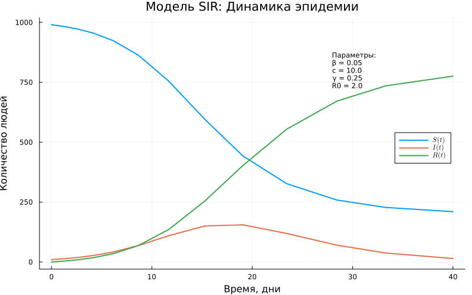

# Вводная часть

## Цель работы

- Изучить динамические модели и их математическое представление
- Реализовать моделирование систем в среде Julia
- Исследовать влияние параметров моделей с применением параметрического анализа
- Проанализировать:
  - поведение систем во времени
  - фазовые портреты моделей
  - особенности вычислительных затрат

# Модель SIR

## Описание процесса

Модель описывает распространение инфекции в популяции, разделенной на восприимчивых, инфицированных и выздоровевших.

## Результаты моделирования

Исследовано изменение численности групп на заданном временном интервале. График демонстрирует динамику эпидемии и достижение пика заражений.

{width=85%}

# Модель Лотки–Вольтерры

## Динамика популяций

Выполнены расчёты для модели «хищник–жертва». Наблюдаются периодические колебания численности обоих видов.

{width=90%}

## Фазовый портрет

Анализ фазовой плоскости подтверждает циклическую природу взаимодействия системы.

{width=85%}

# Параметрическое исследование

## Влияние параметров

Изучена зависимость поведения системы от изменения коэффициентов. Смена параметров ведет к изменению амплитуды и частоты колебаний.

{width=85%}

## Вычислительные аспекты

Изучена структура проекта и генерация автоматических отчетов.

{width=85%}

# Итоги

## Выводы

- Проведённые вычислительные эксперименты подтвердили теоретические положения динамических моделей
- Установлено влияние коэффициентов на устойчивость и характер протекания процессов
- Освоены инструменты автоматизации отчетности и литературного программирования