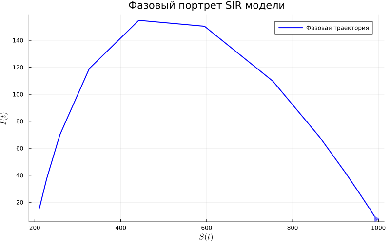
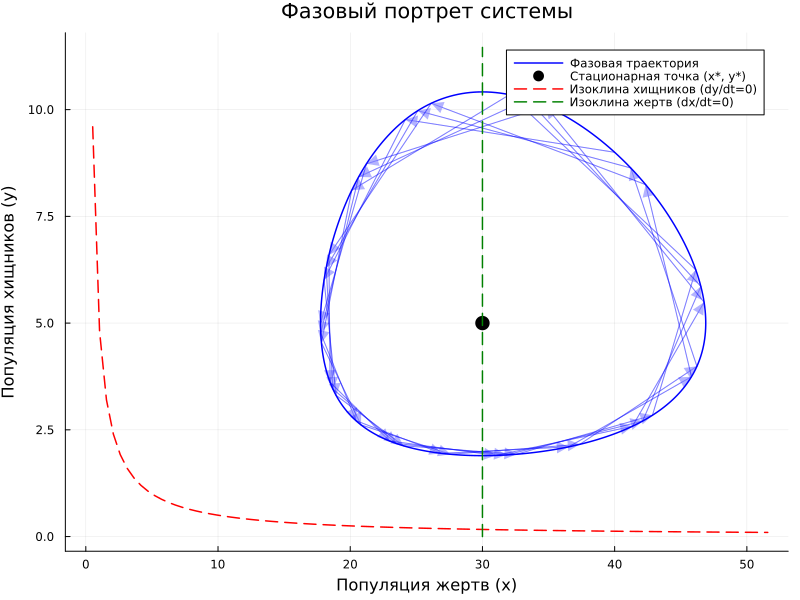

---
## Author
author:
  name: Виктория Симонова
  orcid: 0000-0002-0877-7063
  email: nikolkidm40@gmail.com
  affiliation:
    - name: Российский университет дружбы народов
      country: Российская Федерация
      city: Москва
      address: ул. Миклухо-Маклая, д. 6

## Title
title: "Лабораторная работа №2"
subtitle: "Основные модели"
license: "CC BY"

## Настройки выполнения (добавлены тобой)
execute:
  freeze: true   # Использует уже готовые графики из .ipynb
  eval: false     # Категорически запрещает запускать Julia

format:
  pdf:
    pdf-engine: lualatex
    fig-format: png
    graphics: true
    # Добавьте это, чтобы использовать браузер для конвертации сложных картинок
    default-image-extension: png
---

# Цель работы

Приобретение практических навыков построения имитационных моделей на языке Julia Модель SIR и Модель Лотки–Вольтерры , освоение инструментов автоматизации подготовки отчетов (DrWatson, Literate, Quarto) .


# Задание

— Создать рабочий каталог для кода.
— Установить необходимые пакеты.
— Выполнить предложенный код.
— Преобразовать код в литературный стиль.
— Сгенерировать из литературного кода:
— чистый код;
— jupyter notebook;
— документацию в формате Quarto.
— Выполнить код из jupyter notebook.
— Интегрировать документацию в формате Quarto в отчёт.
— Добавить в код в литературном стиле вычисление для набора параметров.
— Сгенерировать из литературного кода с параметрами:
— чистый код;
— jupyter notebook;
— документацию в формате Quarto.
— Выполнить код из jupyter notebook с параметрами.
— Интегрировать документацию с параметрами в формате Quarto в отчёт

# Выполнение лабораторной работы

## Sir

Подготовка рабочего пространства ([рис. @fig-001]).

{#fig-001 width=70%}

Cтавлю необходимые Пакеты ([рис. @fig-002]).

{#fig-002 width=70%}

Выполнение предложенного кода обоих моделей, получились графики ([рис. @fig-003]).

{#fig-003 width=70%}

Генерация чистого кода ([рис. @fig-004]).

{#fig-004 width=70%}

Генерация jupyter notebook ([рис. @fig-005]).

{#fig-005 width=70%}

### Реализация модели

```julia

using DrWatson
@quickactivate "project"

using DifferentialEquations
using SimpleDiffEq
using Tables
using DataFrames
using StatsPlots
using LaTeXStrings  # Для красивого отображения формул на графиках
using Plots
using BenchmarkTools

script_name = splitext(basename(PROGRAM_FILE))[1]
mkpath(plotsdir(script_name))
mkpath(datadir(script_name))

function sir_ode!(du, u, p, t)
    (S, I, R) = u
    (β, c, γ) = p
    N = S + I + R
    @inbounds begin
        du[1] = -β * c * I / N * S
        du[2] = β * c * I / N * S - γ * I
        du[3] = γ * I
    end
    nothing
end

# ## Определение параметров и расчет
# Исследуем влияние числа контактов $c$ на динамику эпидемии.
params_dict = Dict(
    :β => [0.05],            # Вероятность заражения
    :c => [5.0, 10.0, 15.0], # Варианты контактов
    :γ => [0.25]             # Скорость выздоровления
)

dicts = dict_list(params_dict)

# Общие настройки
δt, tmax = 0.1, 60.0
tspan = (0.0, tmax)
u0 = [990.0, 10.0, 0.0]

# Переменные для хранения финальных результатов (глобальные для Literate)
global sol_ode = nothing
global prob_ode = nothing # Добавили сюда
global df_ode = nothing
global p = []
global R0 = 0.0

# ### Цикл моделирования
for (i, d) in enumerate(dicts)
    local_p = [d[:β], d[:c], d[:γ]]
    local_R0 = (local_p[2] * local_p[1]) / local_p[3]
    
    local_prob = ODEProblem(sir_ode!, u0, tspan, local_p) # Сделали локальной
    local_sol = solve(local_prob, dt = δt)
    
    ## Сохраняем последний прогон для детального анализа ниже
    if i == length(dicts)
        global sol_ode = local_sol
        global prob_ode = local_prob # Обязательно выносим наружу!
        global p = local_p
        global R0 = local_R0
        global df_ode = DataFrame(Tables.table(sol_ode'))
        rename!(df_ode, ["S", "I", "R"])
        df_ode[!, :t] = sol_ode.t
        df_ode[!, :N] = df_ode.S + df_ode.I + df_ode.R
    end
    
    println("Набор $i: c = $(d[:c]), R₀ = $(round(local_R0, digits=2))")
end

# ### Цикл моделирования
for (i, d) in enumerate(dicts)
    local_p = [d[:β], d[:c], d[:γ]]
    local_R0 = (local_p[2] * local_p[1]) / local_p[3]
    
    prob_ode = ODEProblem(sir_ode!, u0, tspan, local_p)
    local_sol = solve(prob_ode, dt = δt)
    
    ## Сохраняем последний прогон для детального анализа ниже
    if i == length(dicts)
        global sol_ode = local_sol
        global p = local_p
        global R0 = local_R0
        global df_ode = DataFrame(Tables.table(sol_ode'))
        rename!(df_ode, ["S", "I", "R"])
        df_ode[!, :t] = sol_ode.t
        df_ode[!, :N] = df_ode.S + df_ode.I + df_ode.R
    end
    
    println("Набор $i: c = $(d[:c]), R₀ = $(round(local_R0, digits=2))")
end


# Вывод параметров модели
println("Параметры модели SIR:")
println("β (вероятность заражения) = ", p[1])
println("c (среднее число контактов) = ", p[2])
println("γ (скорость выздоровления) = ", p[3])
println("R₀ = c * β / γ = ", round(R0, digits=3))
println("Средняя продолжительность болезни = ", round(1/p[3], digits=2), " дней")
println("Начальные условия: S₀ = ", u0[1], ", I₀ = ", u0[2], ", R₀ = ", u0[3])

# 1. ОСНОВНОЙ ГРАФИК: динамика всех трех групп
plt1 = @df df_ode plot(:t,
    [:S :I :R],
    label=[L"S(t)" L"I(t)" L"R(t)"],
    xlabel="Время, дни",
    ylabel="Количество людей",
    title="Модель SIR: Динамика эпидемии",
    linewidth=2,
    legend=:right,
    grid=true,
    size=(800, 500))

# Добавление аннотаций с параметрами
annotate!(plt1, maximum(df_ode.t) * 0.7, maximum(df_ode.N) * 0.8,
    text("Параметры:\nβ = $(p[1])\nc = $(p[2])\nγ = $(p[3])\nR₀ = $(round(R0, digits=2))",
    8, :left))

# График только инфицированных (I)
plt2 = @df df_ode plot(:t, :I,
    label=L"I(t)",
    xlabel="Время, дни",
    ylabel="Количество инфицированных",
    title="Динамика числа зараженных",
    color=:red,
    linewidth=2,
    fill=(0, 0.3, :red),
    grid=true,
    size=(800, 400))

# Отметка пика эпидемии
peak_idx = argmax(df_ode.I)
peak_time = df_ode.t[peak_idx]
peak_value = df_ode.I[peak_idx]
vline!(plt2, [peak_time], color=:black, linestyle=:dash, label=false, linewidth=1)
annotate!(plt2, peak_time, peak_value * 1.05,
    text("Пик: $(round(peak_value, digits=1)) на $(round(peak_time, digits=1)) день",
    8, :top))

# График в логарифмическом масштабе (для анализа экспоненциального роста)
plt3 = @df df_ode plot(:t, :I,
    label=L"I(t)",
    xlabel="Время, дни",
    ylabel="Количество инфицированных (лог. масштаб)",
    title="Экспоненциальный рост (лог. шкала)",
    yscale=:log10,
    color=:red,
    linewidth=2,
    grid=true,
    size=(800, 400))

# График долей населения (в процентах)
plt4 = @df df_ode plot(:t,
    [:S :I :R] ./ df_ode.N .* 100,
    label=[L"S(t)/N" L"I(t)/N" L"R(t)/N"],
    xlabel="Время, дни",
    ylabel="Доля популяции, %",
    title="Динамика эпидемии (в процентах)",
    linewidth=2,
    legend=:right,
    grid=true,
    size=(800, 500))

# Горизонтальная линия для порога коллективного иммунитета
if R0 > 1
    herd_immunity_threshold = (1 - 1/R0) * 100
    hline!(plt4, [herd_immunity_threshold], color=:purple, linestyle=:dash,
        label="Порог коллективного иммунитета ($(round(herd_immunity_threshold, digits=1))%)",
        linewidth=1.5)
end

# Фазовый портрет (I vs S)
plt5 = plot(df_ode.S, df_ode.I,
    label="Фазовая траектория",
    xlabel=L"S(t)",
    ylabel=L"I(t)",
    title="Фазовый портрет SIR модели",
    color=:blue,
    linewidth=2,
    grid=true,
    size=(800, 500),
    legend=:topright)

# Добавление стрелок направления
for i in 1:50:length(df_ode.S)-1
    plot!(plt5, [df_ode.S[i], df_ode.S[i+1]], [df_ode.I[i], df_ode.I[i+1]],
        arrow=:closed, color=:blue, alpha=0.5, label=false)
end

# График Rₑ - эффективного репродуктивного числа
df_ode[!, :Re] = R0 .* df_ode.S ./ df_ode.N
plt6 = @df df_ode plot(:t, :Re,
    label=L"R_e(t)",
    xlabel="Время, дни",
    ylabel=L"R_e",
    title="Динамика эффективного репродуктивного числа",
    color=:green,
    linewidth=2,
    grid=true,
    size=(800, 400))

# Горизонтальная линия на уровне 1
hline!(plt6, [1.0], color=:red, linestyle=:dash, label="Порог эпидемии (Rₑ=1)", linewidth=1.5)

# Отметка момента, когда Rₑ становится < 1
cross_idx = findfirst(x -> x < 1, df_ode.Re)
if !isnothing(cross_idx) && cross_idx > 1
    cross_time = df_ode.t[cross_idx]
    vline!(plt6, [cross_time], color=:black, linestyle=:dash, label=false, linewidth=1)
    annotate!(plt6, cross_time, 1.2,
        text("Rₑ<1 с $(round(cross_time, digits=1)) дня", 8, :left))
end

# Компактный график всех кривых в одной панели
plt7 = plot(layout=(2, 3), size=(1200, 800))

# Верхний ряд
plot!(plt7[1], df_ode.t, df_ode.S, label=L"S(t)", color=1, linewidth=2, title="Восприимчивые")
plot!(plt7[2], df_ode.t, df_ode.I, label=L"I(t)", color=2, linewidth=2, title="Зараженные")
plot!(plt7[3], df_ode.t, df_ode.R, label=L"R(t)", color=3, linewidth=2, title="Выздоровевшие")

# Нижний ряд
plot!(plt7[4], df_ode.t, df_ode.I, label=L"I(t)", color=2, linewidth=2,
    yscale=:log10, title="Лог. масштаб")
plot!(plt7[5], df_ode.S, df_ode.I, label=false, color=4, linewidth=2,
    title="Фазовый портрет", xlabel=L"S", ylabel=L"I")
plot!(plt7[6], df_ode.t, df_ode.Re, label=L"R_e", color=:green, linewidth=2,
    title=L"R_e(t)", hline=[1.0], linestyle=:dash, linecolor=:red)

# Сохранение графиков

savefig(plt1, plotsdir(script_name, "sir_main.png"))
savefig(plt2, plotsdir(script_name, "sir_infected.png"))
savefig(plt3, plotsdir(script_name, "sir_log_scale.png"))
savefig(plt4, plotsdir(script_name, "sir_percentages.png"))
savefig(plt5, plotsdir(script_name, "sir_phase_portrait.png"))
savefig(plt6, plotsdir(script_name, "sir_effective_R.png"))
savefig(plt7, plotsdir(script_name, "sir_panel.png"))

# Бенчмарк для оценки производительности
println("\nБенчмарк решения:")
@benchmark solve(prob_ode, dt = δt)

# Дополнительный анализ
println("\n=== АНАЛИЗ РЕЗУЛЬТАТОВ ===")
println("Общая численность популяции (контроль): N = ", round(df_ode.N[1], digits=1))
println("Пиковое число зараженных: I_max = ", round(peak_value, digits=1))
println("Время достижения пика: t_peak = ", round(peak_time, digits=1), " дней")
println("Итоговое число переболевших: R(∞) = ", round(df_ode.R[end], digits=1))
println("Доля переболевших: ", round(df_ode.R[end]/df_ode.N[1]*100, digits=1), "%")

if R0 > 1
    println("\nТеоретический анализ:")
    println("  - Порог коллективного иммунитета: ", round((1-1/R0)*100, digits=1), "%")
    println("  - Теоретический пик при S/N = 1/R₀ = ", round(1/R0, digits=3))
end

# # Анализ модели SIR с разными параметрами
# Исследуем влияние вероятности заражения (β) на пик эпидемии.

# ## Определение набора параметров
beta_values = [0.03, 0.05, 0.08] # Разные значения β
plt_comparison = plot(title="Влияние β на количество инфицированных", xlabel="Время", ylabel="I(t)")

for b in beta_values
    local p_new = [b, 10.0, 0.25] # Обновляем β
    local prob = ODEProblem(sir_ode!, u0, tspan, p_new)
    local sol = solve(prob, dt = δt)
    
    ## Добавляем кривую на общий график
    plot!(plt_comparison, sol.t, [u[2] for u in sol.u], label="β = $b", linewidth=2)
end

# ## Отображение и сохранение результата
# Сохраняем сравнительный график
savefig(plt_comparison, plotsdir(script_name, "comparison_beta.png"))
plt_comparison

```

Результаты ([рис. @fig-006]).

{#fig-006 width=70%}

Результаты ([рис. @fig-007]).

{#fig-007 width=70%}

Результаты ([рис. @fig-008]).

{#fig-008 width=70%}

Результаты ([рис. @fig-009]).

{#fig-009 width=70%}

Результаты ([рис. @fig-010]).

{#fig-010 width=70%}

Результаты ([рис. @fig-011]).

{#fig-011 width=70%}   

Результаты ([рис. @fig-012]).

{#fig-012 width=70%} 

## Sir_params

заменила

```julia
# Параметры модели
δt = 0.1
tmax = 40.0
tspan = (0.0, tmax)
u0 = [990.0, 10.0, 0.0]  # S, I, R
p = [0.05, 10.0, 0.25]   # β, c, γ

# Расчет базового репродуктивного числа
R0 = (p[2] * p[1]) / p[3]  # R₀ = (c * β) / γ

# Создание и решение задачи
prob_ode = ODEProblem(sir_ode!, u0, tspan, p)
sol_ode = solve(prob_ode, dt = δt)

```
на

```julia
# Определение набора параметров для перебора
params_dict = Dict(
    :β => [0.05],          # Вероятность заражения
    :c => [5.0, 10.0, 15.0], # РАЗНЫЕ варианты среднего числа контактов
    :γ => [0.25]           # Скорость выздоровления
)

dicts = dict_list(params_dict)

# Общие настройки времени
δt = 0.1
tmax = 60.0
tspan = (0.0, tmax)
u0 = [990.0, 10.0, 0.0]

# Цикл по всем комбинациям параметров
for (i, d) in enumerate(dicts)
    p = [d[:β], d[:c], d[:γ]]
    R0 = (p[2] * p[1]) / p[3]
    
    # Решение
    prob_ode = ODEProblem(sir_ode!, u0, tspan, p)
    sol_ode = solve(prob_ode, dt = δt)
    
    # Создание DataFrame
    df_temp = DataFrame(Tables.table(sol_ode'))
    rename!(df_temp, ["S", "I", "R"])
    df_temp[!, :t] = sol_ode.t
    
    # Сохранение данных для каждого набора (с уникальным именем)
    filename = "sir_data_c$(d[:c]).csv"
    safesave(datadir(script_name, filename), df_temp)
    
    println("Обработан набор $i: c = $(d[:c]), R₀ = $(round(R0, digits=2))")
    
    # Далее используй sol_ode или df_temp для построения графиков внутри этого цикла
    # или сохрани последнюю версию для совместимости с твоим кодом ниже
    global sol_ode = sol_ode
    global df_ode = df_temp
    global p = p
    global R0 = R0
end

```

Показываю, как меняется эпидемия при разных сценариях ([рис. @fig-013]).

{#fig-013 width=70%}

## Модель Лотки–Вольтерры

Выполнение предложенного кода обоих моделей, получились графики ([рис. @fig-014]).

{#fig-014 width=70%}

Генерация чистого кода ([рис. @fig-015]).

{#fig-015 width=70%}

Генерация jupyter notebook ([рис. @fig-016]).

{#fig-016 width=70%}

### Реализация модели

```julia
using DrWatson
@quickactivate "project"

using DifferentialEquations
using DataFrames
using StatsPlots
using LaTeXStrings
using Plots
using Statistics
using FFTW

script_name = splitext(basename(PROGRAM_FILE))[1]
mkpath(plotsdir(script_name))
mkpath(datadir(script_name))

# Описание модели Лотки-Вольтерры
"""
Модель Лотки-Вольтерры (хищник-жертва)
Система уравнений:
dx/dt = αx - βxy # Изменение популяции жертв
dy/dt = δxy - γy # Изменение популяции хищников
Где:
x - популяция жертв (например, зайцы)
y - популяция хищников (например, лисы)
α - естественный прирост жертв (в отсутствие хищников)
β - коэффициент поедания жертв хищниками
δ - коэффициент прироста хищников за счет поедания жертв
γ - естественная смертность хищников (в отсутствие жертв)
"""
# # Реализация модели
# Описываем систему дифференциальных уравнений.

function lotka_volterra!(du, u, p, t)
    x, y = u
    α, β, δ, γ = p
    @inbounds begin
        du[1] = α*x - β*x*y
        du[2] = δ*x*y - γ*y
    end
    nothing
end

# Параметры модели и начальные условия
# Классические параметры из литературы
p_lv = [0.1, 0.2, 0.3, 0.4]
# γ: смертность хищников

# Начальные условия: [жертвы, хищники]
u0_lv = [40.0, 9.0] # начальная популяция

# Временные параметры
tspan_lv = (0.0, 200.0) # длительность симуляции
dt_lv = 0.01 
# шаг интегрирования

prob_lv = ODEProblem(lotka_volterra!, u0_lv, tspan_lv, p_lv)
sol_lv = solve(prob_lv, Tsit5(), dt = dt_lv, adaptive = true) 
## Все параметры solve должны быть в одном блоке без разрывов

# Подготовка данных
df_lv = DataFrame()
df_lv[!, :t] = sol_lv.t
df_lv[!, :prey] = [u[1] for u in sol_lv.u] # жертвы
df_lv[!, :predator] = [u[2] for u in sol_lv.u] # хищники

# Рассчет производных для анализа
df_lv[!, :dprey_dt] = p_lv[1] .* df_lv.prey .- p_lv[2] .* df_lv.prey .* df_lv.predator 
df_lv[!, :dpredator_dt] = p_lv[3] .* df_lv.prey .* df_lv.predator .- p_lv[4] .* df_lv.predator 

# Вывод информации о модели
println("="^60)
println("Модель Лотки-Вольтерры (хищник-жертва)")
println("="^60)
println("\nПараметры модели:")
println("α (скорость размножения жертв) = ", p_lv[1])
println("β (скорость поедания жертв) = ", p_lv[2])
println("δ (коэффициент конверсии) = ", p_lv[3])
println("γ (смертность хищников) = ", p_lv[4])
println("\nНачальные условия:")
println("Жертвы (x0) = ", u0_lv[1])
println("Хищники (y0) = ", u0_lv[2])

# Стационарные точки (нулевые изоклины)
x_star = p_lv[4] / p_lv[3] # стационарная точка для жертв
y_star = p_lv[1] / p_lv[2] # стационарная точка для хищников
println("\nСтационарные точки (положения равновесия):")
println("x* = γ/δ = ", round(x_star, digits=3))
println("y* = α/β = ", round(y_star, digits=3))

# Построение графиков
# График 1: Динамика популяций во времени
plt1 = plot(df_lv.t, [df_lv.prey df_lv.predator],
    label=[L"Жертвы (x)" L"Хищники (y)"],
    xlabel="Время",
    ylabel="Популяция",
    title="Модель Лотки-Вольтерры: Динамика популяций",
    linewidth=2,
    legend=:topright,
    grid=true,
    size=(900, 500),
    color=[:green :red])

# Добавление стационарных уровней
hline!(plt1, [x_star], color=:green, linestyle=:dash, alpha=0.5, label="x* (равновесие жертв)") 
hline!(plt1, [y_star], color=:red, linestyle=:dash, alpha=0.5, label="y* (равновесие хищников)") 

# График 2: Фазовый портрет (хищники vs жертвы)
plt2 = plot(df_lv.prey, df_lv.predator,
    label="Фазовая траектория",
    xlabel="Популяция жертв (x)",
    ylabel="Популяция хищников (y)",
    title="Фазовый портрет системы",
    color=:blue,
    linewidth=1.5,
    grid=true,
    size=(800, 600),
    legend=:topright)

# Добавление стрелок направления на фазовом портрете
step = 50 # шаг для отображения стрелок
for i in 1:step:length(df_lv.prey)-step
    plot!(plt2, [df_lv.prey[i], df_lv.prey[i+step]],
          [df_lv.predator[i], df_lv.predator[i+step]],
          arrow=:closed, color=:blue, alpha=0.3, label=false)
end

# Добавление стационарной точки
scatter!(plt2, [x_star], [y_star],
    color=:black, markersize=8, label="Стационарная точка (x*, y*)")

# Изоклины (нулевого роста)
x_range = LinRange(0, maximum(df_lv.prey)*1.1, 100)
y_nullcline = p_lv[1] ./ (p_lv[2] .* x_range) # y-изоклина (dy/dt = 0) 

plot!(plt2, x_range, y_nullcline,
    color=:red, linestyle=:dash, linewidth=1.5, label="Изоклина хищников (dy/dt=0)") 

y_range = LinRange(0, maximum(df_lv.predator)*1.1, 100)
x_nullcline = p_lv[4] ./ (p_lv[3] .* ones(length(y_range))) # x-изоклина (dx/dt = 0) 

plot!(plt2, x_nullcline, y_range,
    color=:green, linestyle=:dash, linewidth=1.5, label="Изоклина жертв (dx/dt=0)") 

# График 3: Производные (скорости изменения)
plt3 = plot(df_lv.t, [df_lv.dprey_dt df_lv.dpredator_dt],
    label=[L"dx/dt" L"dy/dt"],
    xlabel="Время",
    ylabel="Скорость изменения",
    title="Производные популяций",
    linewidth=1.5,
    legend=:topright,
    grid=true,
    size=(900, 400),
    color=[:green :red])

hline!(plt3, [0], color=:black, linestyle=:solid, alpha=0.3, label=false) 

# График 4: Относительные изменения (в %)
df_lv[!, :prey_pct_change] = df_lv.dprey_dt ./ df_lv.prey .* 100
df_lv[!, :predator_pct_change] = df_lv.dpredator_dt ./ df_lv.predator .* 100 

plt4 = plot(df_lv.t, [df_lv.prey_pct_change df_lv.predator_pct_change], 
    label=[L"dx/dt / x (\%)" L"dy/dt / y (\%)"],
    xlabel="Время",
    ylabel="Относительное изменение, %",
    title="Относительные темпы роста",
    linewidth=1.5,
    legend=:topright,
    grid=true,
    size=(900, 400),
    color=[:green :red])

# График 5: Спектральный анализ (быстрое преобразование Фурье)
function compute_fft(signal, dt)
    n = length(signal)
    # Используем rfft для вещественных сигналов (возвращает только положительные частоты) 
    spectrum = abs.(rfft(signal))
    # Соответствующие частоты для rfft
    freq = rfftfreq(n, 1/dt)
    return freq, spectrum
end

# Вычисление периодов колебаний
freq_prey, spectrum_prey = compute_fft(df_lv.prey .- mean(df_lv.prey), dt_lv) 
freq_predator, spectrum_predator = compute_fft(df_lv.predator .- mean(df_lv.predator), dt_lv) 

plt5 = plot(freq_prey, [spectrum_prey spectrum_predator],
    label=[L"Жертвы (x)" L"Хищники (y)"],
    xlabel="Частота",
    ylabel="Амплитуда",
    title="Спектральный анализ (Фурье)",
    linewidth=1.5,
    xscale=:log10,
    yscale=:log10,
    legend=:topright,
    grid=true,
    size=(800, 400),
    color=[:green :red])

# Нахождение доминирующих частот
if length(spectrum_prey) > 0
    idx_prey = argmax(spectrum_prey[2:end]) + 1 # пропускаем нулевую частоту 
    dominant_freq_prey = freq_prey[idx_prey]
    period_prey = 1/dominant_freq_prey
    println("\nДоминирующая частота колебаний жертв: ", round(dominant_freq_prey, digits=4), " Гц") 
    println("Период колебаний жертв: ", round(period_prey, digits=2), " единиц времени") 
end

# График 6: Компактная панель всех графиков
plt6 = plot(layout=(3, 2), size=(1200, 900))

plot!(plt6[1], df_lv.t, df_lv.prey, label=L"x(t)", color=:green, linewidth=2, title="Популяция жертв", grid=true)
plot!(plt6[2], df_lv.t, df_lv.predator, label=L"y(t)", color=:red, linewidth=2, title="Популяция хищников", grid=true)
plot!(plt6[3], df_lv.prey, df_lv.predator, label=false, color=:blue, linewidth=1.5, title="Фазовый портрет", xlabel=L"x", ylabel=L"y", grid=true)
scatter!(plt6[3], [x_star], [y_star], color=:black, markersize=5, label="(x*, y*)") 
plot!(plt6[4], df_lv.t, [df_lv.dprey_dt df_lv.dpredator_dt], label=[L"dx/dt" L"dy/dt"], color=[:green :red], linewidth=1.5, title="Скорости изменения", grid=true, legend=:topright)
plot!(plt6[5], freq_prey, spectrum_prey, label=L"x", color=:green, linewidth=1.5, title="Спектр жертв", xscale=:log10, yscale=:log10, grid=true)
plot!(plt6[6], df_lv.t, [df_lv.prey_pct_change df_lv.predator_pct_change], label=[L"dx/x" L"dy/y"], color=[:green :red], linewidth=1.5, title="Относительные изменения", grid=true, legend=:topright)

# Анализ результатов
println("\n" * "="^60)
println("Анализ результатов")
println("="^60)

println("\nОсновные статистики:")
println("Жертвы: min = ", round(minimum(df_lv.prey), digits=2),
        ", max = ", round(maximum(df_lv.prey), digits=2),
        ", mean = ", round(mean(df_lv.prey), digits=2))
println("Хищники: min = ", round(minimum(df_lv.predator), digits=2),
        ", max = ", round(maximum(df_lv.predator), digits=2),
        ", mean = ", round(mean(df_lv.predator), digits=2))

# Упрощенный анализ колебаний без поиска максимумов
# Вместо сложного анализа сдвига фаз, просто посчитаем основные характеристики 

# Находим время первого пика жертв (простой алгоритм)
function find_first_peak(signal, time)
    for i in 2:length(signal)-1
        if signal[i] > signal[i-1] && signal[i] > signal[i+1]
            return time[i], signal[i]
        end
    end
    return NaN, NaN
end

peak_time_prey, peak_value_prey = find_first_peak(df_lv.prey, df_lv.t) 
peak_time_predator, peak_value_predator = find_first_peak(df_lv.predator, df_lv.t) 

if !isnan(peak_time_prey) && !isnan(peak_time_predator)
    phase_shift = peak_time_predator - peak_time_prey
    println("\nАнализ колебаний:")
    println("Первый пик жертв: время = ", round(peak_time_prey, digits=2), ", значение = ", round(peak_value_prey, digits=2))
    println("Первый пик хищников: время = ", round(peak_time_predator, digits=2), ", значение = ", round(peak_value_predator, digits=2))
    println("Сдвиг фаз (хищники отстают): ", round(phase_shift, digits=2)) 
end

# Сохранение графиков
savefig(plt1, plotsdir(script_name, "lv_dynamics.png"))
savefig(plt2, plotsdir(script_name, "lv_phase_portrait.png"))
savefig(plt3, plotsdir(script_name, "lv_derivatives.png"))
savefig(plt4, plotsdir(script_name, "lv_relative_changes.png"))
savefig(plt5, plotsdir(script_name, "lv_spectrum.png"))
savefig(plt6, plotsdir(script_name, "lv_panel.png"))

println("\n" * "="^60)
println("Моделирование завершено успешно! Графики сохранены в plots/$(script_name)")
println("="^60)

# Функция для анализа влияния параметров
function analyze_parameter_sensitivity(param_index, values, param_name) 
    println("\nАнализ чувствительности к параметру: ", param_name)
    results = []
    for val in values
        p_test = copy(p_lv)
        p_test[param_index] = val
        prob_test = ODEProblem(lotka_volterra!, u0_lv, tspan_lv, p_test)
        sol_test = solve(prob_test, dt = dt_lv)
        prey_end = sol_test.u[end][1]
        predator_end = sol_test.u[end][2]
        push!(results, (param=val, prey=prey_end, predator=predator_end))
        println("$(param_name)=$(val): жертвы=$(round(prey_end, digits=2)), хищники=$(round(predator_end, digits=2))") 
    end
    return results
end

# Анализ чувствительности к ключевым параметрам
if false # Установите в true для выполнения анализа
    println("\n1. Влияние скорости размножения жертв (α):")
    analyze_parameter_sensitivity(1, [0.05, 0.1, 0.2, 0.3], "α")
    println("\n2. Влияние смертности хищников (γ):")
    analyze_parameter_sensitivity(4, [0.1, 0.3, 0.5, 0.7], "γ")
end

println("\nМоделирование завершено успешно!")

# # Анализ модели при изменении параметров
# Исследуем влияние коэффициента рождаемости жертв (alpha) на динамику.

alphas = [0.5, 1.0, 1.5]
p_base = [1.0, 0.1, 0.1, 0.4]

for a in alphas
    p_new = [a, p_base[2], p_base[3], p_base[4]]
    prob_new = ODEProblem(lotka_volterra!, u0, tspan, p_new)
    sol_new = solve(prob_new)
    ## Рисуем график для каждого параметра
    display(plot(sol_new, title="Модель при alpha = $a"))
end
```

Результаты ([рис. @fig-017]).

{#fig-017 width=70%}

Результаты ([рис. @fig-018]).

{#fig-018 width=70%}

Результаты ([рис. @fig-019]).

{#fig-019 width=70%}

Результаты ([рис. @fig-020]).

{#fig-020 width=70%}

Результаты ([рис. @fig-021]).

{#fig-021 width=70%}

Результаты ([рис. @fig-022]).

{#fig-022 width=70%}

## lv_params

```julia
# Анализ чувствительности к ключевым параметрам
if false # Установите в true для выполнения анализа
    println("\n1. Влияние скорости размножения жертв (α):")
    analyze_parameter_sensitivity(1, [0.05, 0.1, 0.2, 0.3], "α")
    println("\n2. Влияние смертности хищников (γ):")
    analyze_parameter_sensitivity(4, [0.1, 0.3, 0.5, 0.7], "γ")
end

println("\nМоделирование завершено успешно!")

# # Анализ модели при изменении параметров
# Исследуем влияние коэффициента рождаемости жертв (alpha) на динамику.

alphas = [0.5, 1.0, 1.5]
p_base = [1.0, 0.1, 0.1, 0.4]

for a in alphas
    p_new = [a, p_base[2], p_base[3], p_base[4]]
    prob_new = ODEProblem(lotka_volterra!, u0, tspan, p_new)
    sol_new = solve(prob_new)
    ## Рисуем график для каждого параметра
    display(plot(sol_new, title="Модель при alpha = $a"))
end
```
Показываю, Анализ модели при изменении параметров ([рис. @fig-023]).

{#fig-023 width=70%}

Показываю, что есть все ноутбуки ([рис. @fig-024]).

{#fig-024 width=70%}

Показываю, что есть все литературные файлы ([рис. @fig-025]).

{#fig-025 width=70%}

# Выводы

Построила имитационные модели на языке Julia Модель SIR и Модель Лотки–Вольтерры.

# Список литературы{.unnumbered}

::: {#refs}
:::
